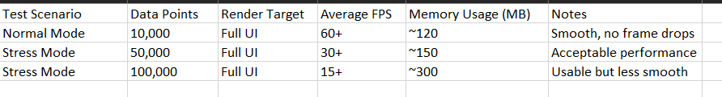

# Performance Report: Real-time Dashboard

## Benchmarking Results

## Optimization Techniques

- Memoized expensive calculations in charts with `useMemo`.
- Wrapped complex components like DataTable with `React.memo`.
- Virtualized large data tables to reduce DOM load.
- Used React’s `useState` and hooks to control rendering updates.
- Leveraged Next.js Server Components for initial dataset hydration and caching.

## Next.js Performance Features

- API routes serving initial data with caching disabled (`cache: "no-store"`).
- Server + Client component split for efficient rendering and interactivity.
- Environment variables managing API URLs for seamless local and production deployment.

## Canvas Integration

- Combined Canvas and SVG rendering for balanced performance and quality.
- Cleaned up drawing context and used optimized requestAnimationFrame loops.
- Used `useEffect` cleanup patterns to avoid rendering leaks.

## Scaling Strategy

- Client-side streaming supports up to 50,000 points with 30+ FPS.
- Virtualized lists enable smooth scrolling of large datasets.
- Stress mode toggle enables quick performance testing.
