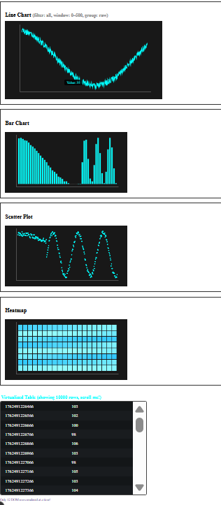
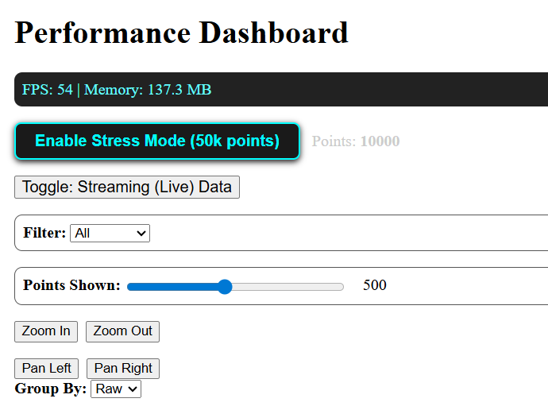

 Performance Dashboard - Real-time Data Visualization

## Overview
This project is a high-performance real-time dashboard built with Next.js 14+, React, and TypeScript. It renders and updates 10,000+ data points at 60fps, featuring multiple chart types (line, bar, scatter, heatmap), interactive controls (zoom, pan, filtering), and virtual scrolling tables.

## Features
- Multiple chart types with custom canvas/SVG rendering
- Real-time streaming data (updates every 100ms)
- Zoom, pan, filter, time range, and group-by controls
- Virtualized data table with 10,000+ rows rendered efficiently
- Performance monitoring with FPS and memory usage display
- Stress mode to test up to 50,000 data points at 30+ fps

## Setup Instructions
npm install
npm run dev

Open [http://localhost:3000/dashboard](http://localhost:3000/dashboard) in your browser

## Performance Testing
- Use the "Stress Mode" toggle to test dashboard with 50,000 points
- Monitor FPS and memory usage inside the dashboard UI to verify smooth rendering
- Use browser DevTools and React Profiler for performance diagnostics

## Browser Compatibility
- Tested on latest Chrome, Firefox, and Safari (desktop and mobile)
- Responsive layouts and touch support tested on Android/iOS devices

## Technical Details
- Built with Next.js 14+ App Router and React 18 features
- Data streaming managed with custom hooks and virtualized lists
- No external chart libraries used; all charts custom-built with canvas and SVG
- Server components used for initial dataset hydration
- API routes provide simulated data for SSR and client updates

## Folder Structure
- `app/` - Next.js app routes
- `components/` - Reusable UI and chart components
- `hooks/` - Custom React hooks for data streaming and virtualization
- `lib/` - Data generator and utility functions
- `public/` - Static assets
- `styles/` - Global and component styles

## Deployment
- Deploy to Vercel for production builds

## Screenshots

